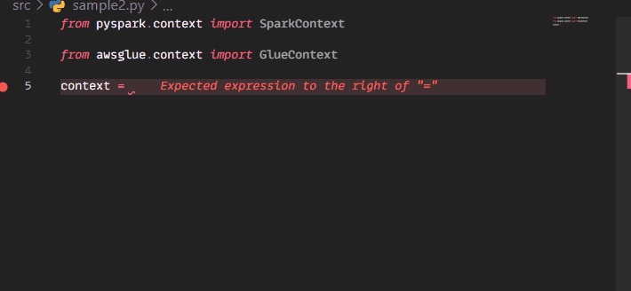
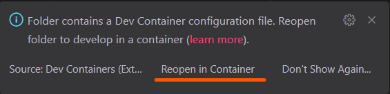

<!-- markdownlint-disable MD012 MD033 MD028-->
# AWS Glue dev container template

- [What's in here](#whats-in-here)
- [Prerequisites](#prerequisites)
- [Getting started](#getting-started)
- [📝 Notes](#-notes)
- [⚠️ Known issues](#️-known-issues)
- [Contributing](#contributing)

This repo provides an out of the box configurable template to develop and test AWS Glue jobs locally, with linting, code formatting, testing and so on.

<p align="center">

</p>

Inspired from [this aws blog post](https://aws.amazon.com/blogs/big-data/develop-and-test-aws-glue-version-3-0-jobs-locally-using-a-docker-container/), and from years spent on painfully debugging Glue jobs on the console and cursing every saint in Paradise.

It has been developed on Windows but should work seamlessly with Linux and macOS.

## What's in here

This devcontainer comes with the following features baked in:

- Poetry for simple management of *(dev)* dependencies
- flake8 for linting
- black for formatting
- isort for import sorting
- pytest for testing
- [chispa](https://github.com/MrPowers/chispa) to provide PySpark test helper methods
- your `~/.aws` folder is mounted in the container (so you can used named profiles)
- out of the box git support inside the container
- custom `.bashrc` sourced at the end of the base image one.

For flake8, black and isort the respective VSCode extensions are included.

Poetry is configured to use a virtualenv inside the project folder, but you can customize its behavior by editing `poetry.toml`. However, I would recommend leaving it as such.

Glue libraries are not included in the virtualenv because they're made available globally by adding them to `PATH`.

You can import them as you would import any other package and they will work as expected.

## Prerequisites

The prerequisites are the same as for running any other devcontainer. For a comprehensive list of requirements, you can [check here](https://code.visualstudio.com/docs/devcontainers/containers#_system-requirements), but the TL;DR is:

- Docker Desktop 2.0+ for Windows and macOS
- Docker 18.06+ and Docker Compose 1.21+ for Linux
- VSCode (duh)

## Getting started

1. Clone this repo locally.
2. Have Docker Desktop running.
3. Open the workspace in VSCode, and when prompted to re-open it in a dev container click "Reopen in container".

This is only necessary the first time you build the container.

<p align="center">

</p>

---

⏳ The first time you do this is gonna take a while.

Once your container has finished building, VSCode is going to notify you that the python extension is not loaded. This is a known issue. Just click "Reload" and you're good to go.

> [!Note]
>
> The name of the created container will follow this pattern:
>
> `<workspace-folder-name>_<username>_glue-pyspark-poetry_devcontainer`
>
> This allows you to have multiple coexisting containers stemming from this template in different projects.
>
> **HOWEVER**, a new Docker image is created when starting this project in a new directory. If you plan to use this project in multiple locations, you should consider building your own image starting from the provided Dockerfile, and reference that in `devcontainer.json`.

---

> [!Caution]
>
> 👉 **FOR LINUX USERS**
>
> Due to file permission shenanigans, run (*outside the container*):
>
> ```bash
> docker exec -u 0 <YOUR-CONTAINER-NAME-OR-ID> bash -c 'chown -R glue_user /tmp/spark-events'
> ```

1. Now create a `.env` file next to `.env.example` and add your AWS named profile.
2. Run `sample.py`, either from VSCode "Run / Debug Python file" button, or from the terminal:

```bash
poetry run python src/sample.py
```

You should see a bunch of non important logs, and then this:

```bash
root
|-- family_name: string
|-- name: string
|-- links: array
|    |-- element: struct
|    |    |-- note: string
|    |    |-- url: string
|-- gender: string
|-- image: string
|-- identifiers: array
|    |-- element: struct
|    |    |-- scheme: string
|    |    |-- identifier: string
|-- other_names: array
|    |-- element: struct
|    |    |-- lang: string
|    |    |-- note: string
|    |    |-- name: string
|-- sort_name: string
|-- images: array
|    |-- element: struct
|    |    |-- url: string
|-- given_name: string
|-- birth_date: string
|-- id: string
|-- contact_details: array
|    |-- element: struct
|    |    |-- type: string
|    |    |-- value: string
|-- death_date: string
```

Now try running tests:

```bash
poetry run pytest --disable-warnings
```

Two tests are set to succeed and one test is set to fail, you should see this printed to the console at the end of the traceback:

```py
E           chispa.dataframe_comparer.DataFramesNotEqualError:
E           +-----------------------+-----------------------+
E           |          df1          |          df2          |
E           +-----------------------+-----------------------+
E           | Row(_1=1.1, _2='asd') |  Row(_1=1.1, _2='a')  |
E           |  Row(_1=2.2, _2='b')  |  Row(_1=2.2, _2='b')  |
E           |  Row(_1=3.3, _2='c')  |  Row(_1=3.3, _2='c')  |
E           |  Row(_1=4.4, _2='d')  |  Row(_1=4.4, _2='d')  |
E           | Row(_1=None, _2=None) | Row(_1=None, _2=None) |
E           +-----------------------+-----------------------+
```

## 📝 Notes

- The container default is to run Glue version 4.0.0 *(and python 3.10+)*. You can change this by editing `devcontainer.json` and changing the version of Glue there. Remember also to set a compatible python version in `pyproject.toml`!

- Spark UI is as always available at `localhost:4040`, but since the UI lives just as long as the SparkContext, it's probably better to use the history server at `localhost:18080`.

- Running a python file from the "Run Python File" button doesn't support loading environment variables from a `.env` file, but the debugger and test runner do. This is an issue with VSCode itself, which is why `dotenv` is added as a conditional dependency for local development.
- Poetry.lock is added to `.gitignore`. Remember to remove it when working on your projects!

## ⚠️ Known issues

The first time one builds the container, VSCode is going to complain that the python extension was not loaded, thus flake8, black and isort ones won't function properly, and will ask the user to reload the window.
This again is a problem with VSCode and the python extension, because the latter loads **only** when a python related file is opened in the editor. Just reload the window and the problem will be gone.

## Contributing

The resulting Docker image is quite hefty (5GB+, 9GB+ for Linux users). It could probably be slimmed down by using multi stage builds and copying only the necessary files to the last stage. If you'd like to give it a shot, feel free to open a pull request!
